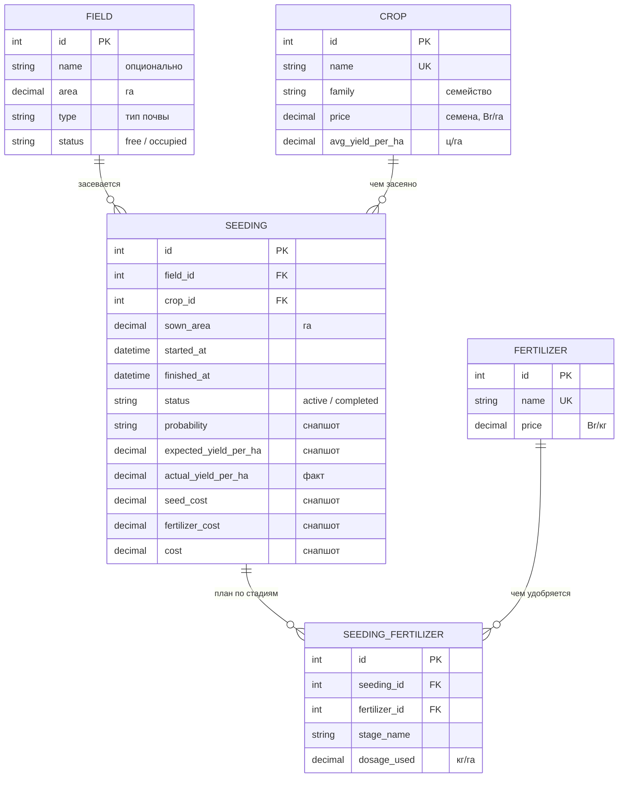

# ByCrop

Прототип информационной системы учёта выращивания культур.

Планирование посева от подбора культуры до закрытия по факту урожая: справочники полей, культур
и удобрений, оценка вероятности урожая по севообороту и почве, план удобрений по стадиям,
расчёт себестоимости.

## Стек

AdonisJS v6, Edge (SSR), SQLite (better-sqlite3), сессионная аутентификация, Alpine.js по минимуму.

## Архитектура

Маршрут → валидатор → контроллер → сервис → модель → SQLite. Контроллеры тонкие:
валидация, вызов сервиса, рендер. Вся бизнес-логика — в `app/services/`.

| Каталог | Содержимое |
|---|---|
| `app/constants/` | Перечисления и таблицы, от которых зависят правила: семейства, почвы, совместимость, шаблоны планов удобрений |
| `app/services/` | `cost_calculation`, `crop_recommendation`, `fertilizer_plan`, `seeding`, `reference_usage` |
| `app/models/` | Lucid-модели и связи |
| `app/exceptions/` | Доменные исключения — сами превращают себя в редирект с сообщением |
| `database/migrations/` | Единственный способ менять схему |
| `resources/` | Edge-шаблоны, CSS, Alpine-компоненты |

### Модель данных



`USER` с остальными таблицами не связан: все пользователи равноправны и видят все данные.


### Единицы

Площадь — га, урожайность — ц/га (везде в расчётах), объём урожая — тонны (только ввод цели
и отображение), цена культуры — Br/га за **семена**, цена удобрения — Br/кг, дозировка — кг/га.

### Правила

**Вероятность урожая** — два бинарных фактора: семейство культуры не совпадает с семейством
предыдущей культуры на поле и тип почвы входит в список подходящих для семейства
(`PREFERRED_SOILS`). Оба → «высокая», один → «средняя», ни одного → «низкая».
Вместе с меткой возвращается причина текстом.

**Себестоимость** — `цена семян × площадь + Σ(цена удобрения × доза на га × площадь)`.
Дополнительно на гектар и на ожидаемую тонну. Выручка и прибыль не считаются: нет цены реализации.

Создание и закрытие посева идут в транзакции: посев, его стадии и статус поля меняются вместе.

### Ограничения

Не SPA, без REST API, без очередей, Redis и Docker — приложение должно подниматься на
shared-хостинге. Ролей и RBAC нет. Схема меняется только миграциями.

## Требования

- Node.js >= 22
- npm

## Запуск локально

```bash
npm install
cp .env.example .env
node ace generate:key          # впишет APP_KEY в .env
node ace migration:run
node ace db:seed               # справочники культур и удобрений
npm run dev
```

Приложение поднимется на `http://localhost:3333`. Первый пользователь создаётся через `/signup`.

## Тесты

```bash
npm run typecheck
npm run lint
node ace test unit
node ace test functional
```

Функциональные тесты используют отдельную БД из `.env.test` (`database/test.sqlite3`) — перед первым запуском накатите на неё миграции:

```bash
NODE_ENV=test node ace migration:run
```

## Продакшен-сборка

```bash
npm run build
cd build
npm ci --omit=dev
node bin/server.js
```

Развёртывание на сервере — `README-DEPLOY.md`.
